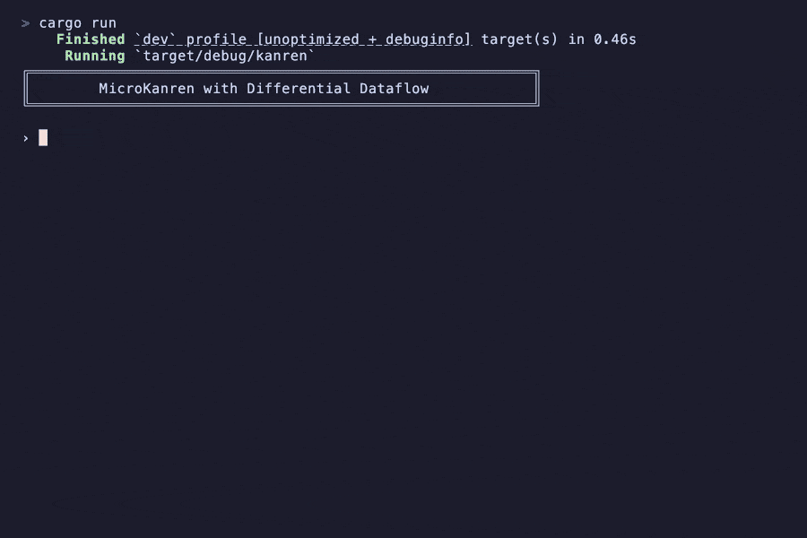

# graphdb



An EAV triplestore backed by [differential dataflow](https://github.com/TimelyDataflow/differential-dataflow).
Data is stored as `[entity attribute value]` datoms and queried with a Datomic-style query language, all parsed from EDN.

```
cargo run
```

## Usage

Load the sample dataset and query it:

```
› eval movies.edn
+ [1 :person/name "Christopher Nolan"]
+ [100 :movie/title "Inception"]
...
loaded 28 expressions

› [:find ?title :where [?m :movie/title ?title]]
{?title: "Inception"}
{?title: "Dune"}
{?title: "Oppenheimer"}
{?title: "Blade Runner"}
{?title: "Blade Runner 2049"}
```

Joins across entities work as you'd expect:

```
› [:find ?name :where [?m :movie/title "Inception"] [?m :movie/director ?d] [?d :person/name ?name]]
{?name: "Christopher Nolan"}
```

Predicates filter results:

```
› [:find ?title ?year :where [?m :movie/title ?title] [?m :movie/year ?year] [(gt ?year 2015)]]
{?title: "Dune", ?year: 2021}
{?title: "Oppenheimer", ?year: 2023}
{?title: "Blade Runner 2049", ?year: 2017}
```

Aggregates:

```
› [:find (count ?m) (min ?y) (max ?y) (avg ?y) :where [?m :movie/title _] [?m :movie/year ?y]]
{(count ?m): 5, (min ?y): 1982, (max ?y): 2023, (avg ?y): 2010}
```

Transactions are immediate:

```
› [:+ 105 :movie/title "Interstellar"] [:+ 105 :movie/year 2014]
+ [105 :movie/title "Interstellar"]
+ [105 :movie/year 2014]
```

Retract with `:-` or `:retract`. `dump` shows all datoms, `drop` clears everything.
